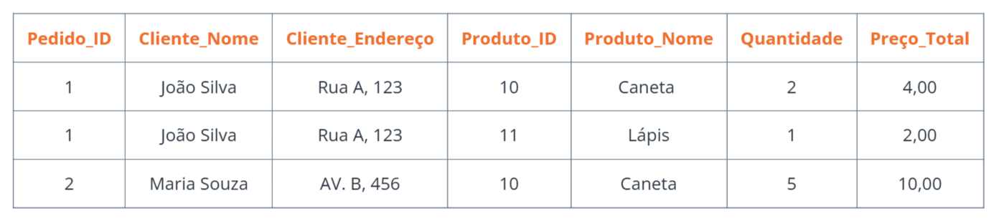

## Explorando Banco de Dados Relacional Não Relacional e Normalização

#### Introdução

Com o crescimento alto da geração de dados nos últimos anos, escolher um modelo de banco de dados adequado se tornou um fator estratégico no desenvolvimento de sistemas e aplicações. Dois dos principais paradigmas de armazenamento de dados são os bancos de dados relacionais e os bancos de dados não relacionais (NoSQL). Cada um apresenta características distintas, que os tornam mais adequados para determinados tipos de projetos, dependendo do volume, estrutura e complexidade dos dados. Enquanto os bancos relacionais se destacam pela organização estruturada em tabelas e forte consistência, os bancos não relacionais oferecem maior flexibilidade, escalabilidade e desempenho em ambientes dinâmicos e com dados semi-estruturados ou não estruturados. Este texto explora as principais diferenças entre esses dois modelos, suas vantagens, limitações e os cenários em que cada um é mais recomendado.

#### O que é um banco de dados relacional?

Um banco de dados relacional é uma maneira de organizar dados em tabela, onde cada tabela é composta por colunas e linhas.

#### Características principais

- Organização em tabelas:
  
Os dados são organizados em tabelas, onde cada tabela tem uma entidade (objeto,conceito...) e suas colunas definem os dados dessa entidade.

- Relacionamentos:

As tabelas são relacionadas por meio de chaves primárias e estrangeiras, permitindo a criação de ligações entre diferentes grupos de dados. 

- Consultas SQL:
  
A manipulação dos dados é feita por meio de consultas em linguagem SQL, que permite buscar, inserir, atualizar e excluir informações. 

- Integridade dos dados:

Bancos de dados relacionais promovem a integridade dos dados por restrições como chaves primárias, chaves estrangeiras e regras de validação. 

- Propriedades ACID:

Transações em bancos de dados relacionais seguem as propriedades ACID, dando credibilidade, confiabilidade e a integridade das operações. 

#### Exemplo de uso

#### O que é um banco de dados não relacional?

Um banco de dados não relacional é um modelo para gerenciar um banco de dados que é diferente dos bancos de dados relacionais. Ao invés de usar tabelas com linhas e colunas para guardar dados, utilizam uma forma de armazenar dados mais flexível, como documentos, chave-valor, colunas ou grafos, para armazenar e acessar informações. 

#### Características principais

- Flexibilidade de esquema:

Não tem exigência de um esquema rígido e pré-definido, permitindo adicionar, remover ou alterar campos conforme a necesssidade. 

- Escalabilidade horizontal:

São criados para escalar na horizontal, adicionando mais máquinas para lidar com o aumento da carga de trabalho. 

Armazenamento de dados não estruturados ou semiestruturados:

Lidam com grandes volumes de dados que não se encaixam em estruturas de tabelas rígidas. 

- Modelos de dados variados:

Utilizam modelo como chave-valor, documentos, grafos ou colunas. 

- Desempenho otimizado:

Oferecem desempenho superior em leitura, principalmente em cenários de alta demanda. 

#### Exemplo de uso

#### O que é normalização? Qual seu objetivo?

Normalização é um processo que tem intenção criar padrões e regras para promover a uniformidade, interoperabilidade e qualidade em várias áreas, como dados, produtos, processos e sistemas. É a atividade que criar normas técnicas para padronizar, deixar mais simples  e organizar atividades e produtos, para facilitar o uso e a compreensão. 
A normalização é utilizada muito mais como um meio para se alcançar a redução de custo da produção e do produto final, mantendo ou melhorando a qualidade.

#### Exemplo feito por mim de tabela não normalizada

json 
CopiarEditar 
{ 
"pedido_id": 1, 
"cliente": { 
}, 
"nome": "João Silva", 
"endereco": "Rua A, 123" 
"itens": [ 
{ 
"produto_id": 10, 
"nome": "Caneta", 
"quantidade": 2, 
"preco_total": 4.00 
}, 
{ 
"produto_id": 11, 
} 
] 
} 
"nome": "Lápis", 
"quantidade": 1, 
"preco_total": 2.00 

